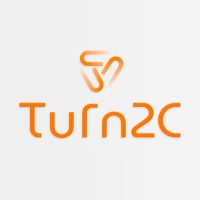

# 
 🔶 TESTE FRONT-END 🔶

#### 
 _Um teste técnico realizado para a empresa Turn2C!_ 

 

***

## 🔶 RESUMO DO TESTE

Neste teste, o framework escolhido foi o **Angular** na versão 16. O principal objetivo foi a avaliação de habilidades e competências como desenvolvedora web. Os conhecimentos observados foram em frameworks SPA, a capacidade de consumir APIs e a habilidade de reproduzir fielmente o design proposto.

***

### 
 ⚠️ ATENÇÃO! Esta aplicação está em desenvolvimento... 💻 

***

#### 🔸 ESTE DESAFIO ESTÁ SENDO DESENVOLVIDO POR: [VANESSA MENEZES](https://github.com/VanessaNMenezes) 🧡

***
